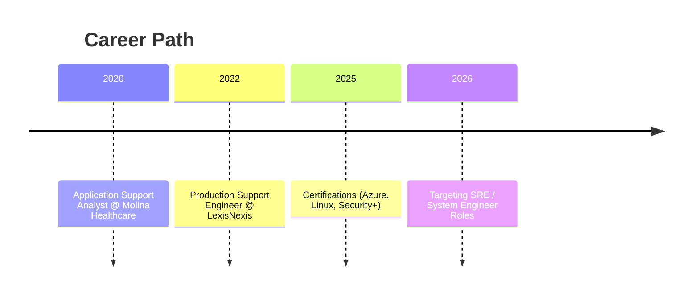

# Michael Dare Olawale


---

## 👨‍💻 About Me
Production Support Engineer with 5+ years of experience in mission-critical banking and healthcare systems. Skilled in automation, monitoring, and incident management.  
**US Citizen — no sponsorship required now or in future.**

---

## 🛠 Skills
- Python, Shell, PowerShell  
- Splunk, AppDynamics, ELK  
- SQL (Oracle, MySQL, SQL Server)  
- ITIL Processes, Incident & Problem Management  
- Control-M, Autosys, Cron  

---

## 📈 Experience Highlights
- Automated health checks reducing manual effort by 30%  
- Improved uptime to 99.99% for banking applications  
- Optimized Oracle queries, reducing report run times significantly  

---

## 🎓 Certifications
- CompTIA Security+ (2023)  
- Microsoft Azure Administrator (2025)  
- Linux Network Administrator (2025)  

---

## 📬 Contact
[](mailto:mdolawale1@gmail.com)
[](https://www.linkedin.com/in/michael-d-olawale-277727349/)
[](https://github.com/mdolawale1-cmyk)


---

## 📊 Career Timeline (Mermaid Diagram)



## ⚙️ Incident Management Process:

```mermaid
flowchart TD
    A[Incident Detected] --> B[Log Analysis with Splunk]
    B --> C[Root Cause Analysis]
    C --> D[Fix Implemented]
    D --> E[Post-Incident Review]

